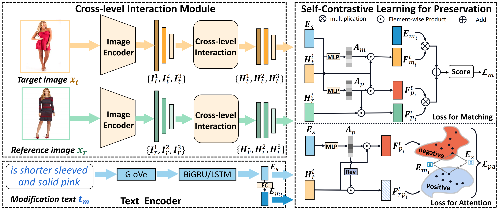
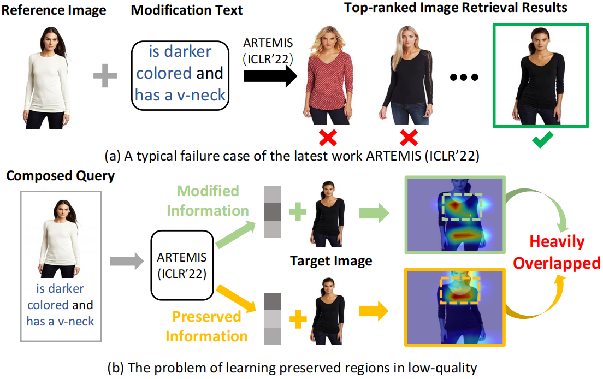
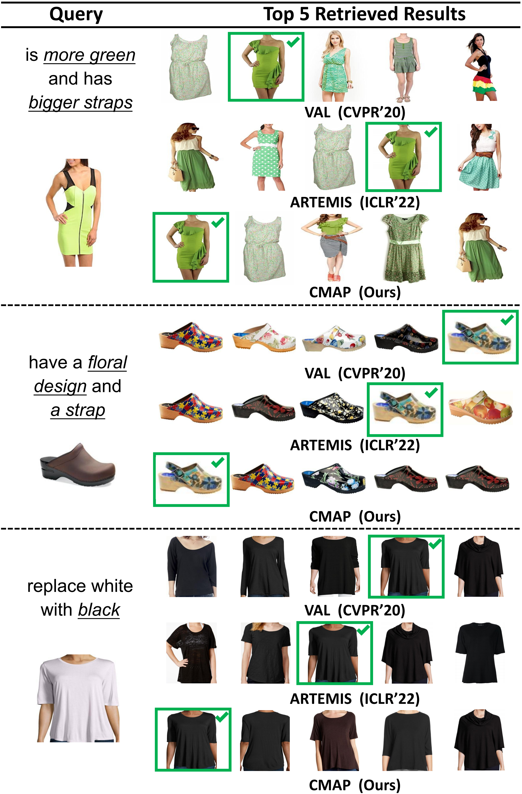
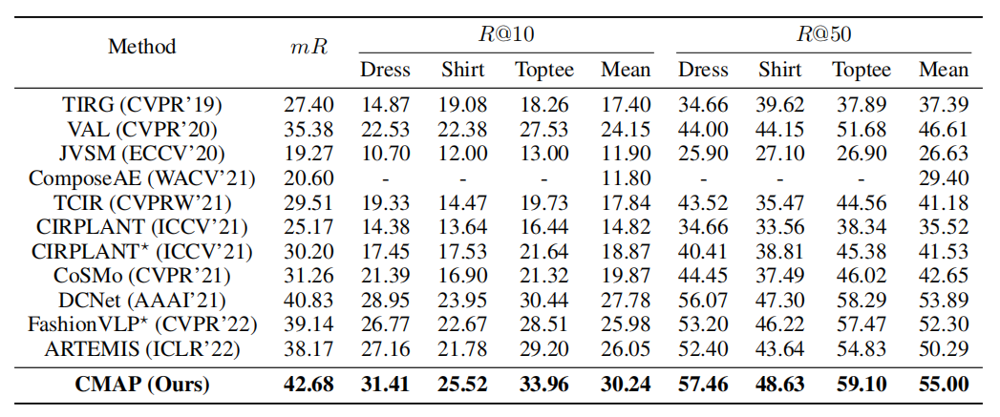

## Introduction
This is the source code of "Cross-Modal Attention Preservation with Self-Contrastive Learning for Composed Query-Based Image Retrieval"

## Cross-Modal Attention Preservation with Self-Contrastive Learning for Composed Query-Based Image Retrieval
The proposed CMAP is a novel method that leverages cross-level interaction and self-contrastive learning to learn optimal preserved information thus significantly improving the performance. It includes a multi-level feature extraction, and leverages the high-level features to complete the inadequate semantic information caused by different depths through fusion gate. Moreover, it uses self-contrastive learning for preservation module to constrain the attention of preservation regions.



## Proposed Model (CMAP)
* Cross-level Interaction Module
* Self-Contrastive Learning for Preservation
* Objective Function
  * Loss for Attention
  * Loss for Matching

## Motivation

An illustrative example of the problem in learning preserved information: (a) A typical failure case of the recent state-of-the-art method ARTEMIS (Delmas et al. 2022). (b) The preserved regions learned by ARTEMIS show heavily overlapped with the modified regions.


## Retrieval Examples



## Data Download
The three datasets (FashionIQ, Shoes, Fashion200k) can be downloaded from the official code release for ARTEMIS (ICLR 2022).
## Usage
* Run vocab.py to compute the corresponding vocabulary
  * You should obtain the following vocabulary size for the different datasets:
    - FashionIQ: 3775
    - Shoes: 1330
    - CIRR: 7101
    - Fashion200K: 4963
* Modify the parameters in option.py
* Run train.py (img_finetune, default=False; txt_finetune, default=False)
* Run train.py (img_finetune, default=False; txt_finetune, default=False)
* Run evaluate.py to evaluate the R@K of the model

## Results


## Acknowledge
We sincerely thank the following works for their provided features and codes.
```bibtex
@inproceedings{delmas2022artemis,
  title={ARTEMIS: Attention-based Retrieval with Text-Explicit Matching and Implicit Similarity},
  author={Delmas, Ginger and Rezende, Rafael S and Csurka, Gabriela and Larlus, Diane},
  booktitle={International Conference on Learning Representations},
  year={2022}
}
@inproceedings{FIQ,
  title={Fashion {IQ}: A new dataset towards retrieving images by natural language feedback},
  author={Wu, Hui and Gao, Yupeng and Guo, Xiaoxiao and Al-Halah, Ziad and Rennie, Steven and Grauman, Kristen and Feris, Rogerio},
  booktitle={Proceedings of the IEEE/CVF conference on Computer Vision and Pattern Recognition},
  pages={11307--11317},
  year={2021}
}
@inproceedings{shoesCaptions,
    title = {Dialog-based Interactive Image Retrieval},
    author = {Guo, Xiaoxiao and Wu, Hui and Cheng, Yu and Rennie, Steven and Tesauro, Gerald and Feris, Rogerio},
    booktitle = {Advances in Neural Information Processing Systems},
    pages = {676--686},
    year = {2018},
}

@inproceedings{shoesImages,
  title={Automatic attribute discovery and characterization from noisy web data},
  author={Berg, Tamara L and Berg, Alexander C and Shih, Jonathan},
  booktitle={European Conference on Computer Vision},
  pages={663--676},
  year={2010},
}
@inproceedings{fashion200k,
  title     = {Automatic spatially-aware fashion concept discovery},
  author    = {Han, Xintong and Wu, Zuxuan and Huang, Phoenix X and Zhang, Xiao and Zhu, Menglong and Li, Yuan and Zhao, Yang and Davis, Larry S},
  booktitle = {Proceedings of the IEEE International Conference on Computer Vision},
  pages     = {1463--1471},
  year      = {2017}
}

```